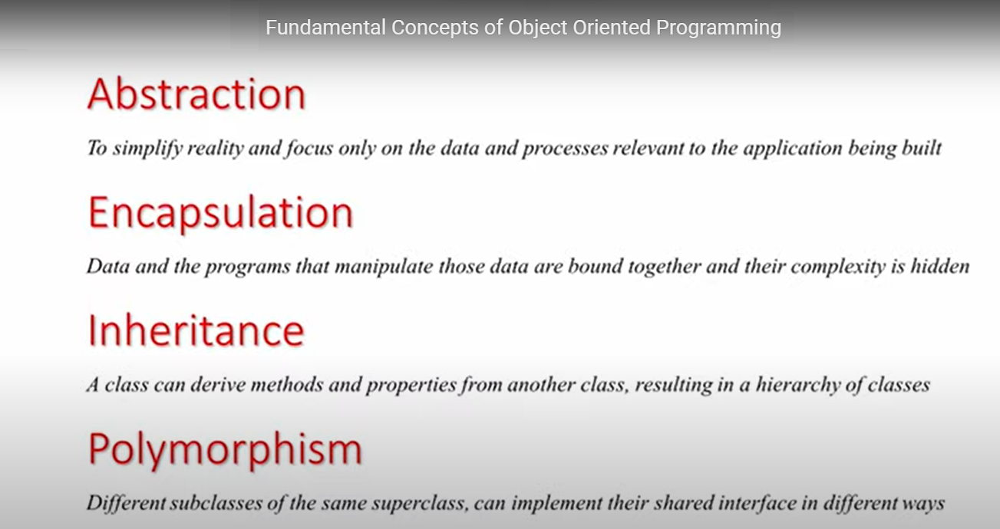

# OOP four principles by example


## What are we building?

We are going to build some classes to represent animals. Initially, we are going to make some naive code and then we'll improve it by using the OOP principles.

While reading this article, create your files with classes and try some code in your IRB console. Keep the files you create saved for upcoming lessons.

## Let's get building

First, make sure you have the code from the previous article [Class vs object: examples](class_and_object_for_irb.md). You should have a file named `animal.rb` with a single class `Animal`.

In your `Animal` class add a `type` parameter and assign it to the `@type` instance variable. It should look like this:

```ruby
class Animal
  def initialize(type, number_of_legs, name = "Unknown")
    @id = Random.rand(1..1000)
    @name = name
    @number_of_legs = number_of_legs
    @type = type
  end
end
```

### Encapsulation

If you try the previous code in IRB you will see that you can't access or modify any of the attributes in either class. This is due to Ruby's encapsulation. Because of this encapsulation the instance variable can't be accessed outside the object, only by methods inside of it.

But then how do you interact with an object? Well, you declare public methods. By default in Ruby any method declared is public (can be called anywhere), but you can also declare them as private (can only be called inside that class).

So, we could create a public method to fetch `@name`'s value and another one to modify it. These types of methods are called **getter** (get a value) and **setter** (set a value) methods. The getter is called the same as the corresponding instance variable and the setter is called the same, but it should be followed by `=` (this is Ruby's special syntax for setters).

Now that you have a better understanding, let's add some getters and setters so we can interact with the attributes. In `animal.rb` modify `Animal` by adding the following:

```ruby
class Animal
  ...

  def id
    @id
  end

  def type
    @type
  end

  def number_of_legs
    @number_of_legs
  end

  def name
    @name
  end

  def name=(value)
    @name = value
  end
end
```

Great! now we can access `Animal`'s attributes and modify `name` if needed.

<details>
<summary>Try it out in your IRB console</summary>

```ruby
require "./animal.rb"

animal_1 = Animal.new("dog", 4, "Rex")
animal_1.id
animal_1.type
animal_1.name
animal_1.number_of_legs

animal_2 = Animal.new("cat", 8)
animal_2.name
animal_2.name = "Fluffy"
animal_2.name
```

</details>

#### Useful shortcuts: attr_reader, attr_writer, and attr_accessor

Ruby offers you a nice way to create your getters and setters!

Instead of writing two methods to get and set a name:

```ruby
  def name
    @name
  end

  def name=(value)
    @name = value
  end
```

You can declare them by using:

```ruby
attr_reader :name
attr_writer :name 
```

Or you can make it even shorter by using:

```ruby
attr_accessor :name
```

Of course if you need only a getter method you will use only `attr_reader`. Likewise, if you need only a setter method, you will use only `attr_writer`.


### Abstraction

Next, we want to see our animals speak (return a string) depending on their type. If we didn't have abstractions we would have to make a method that checks the instance's class and gives the string depending on that. Something like this:

```ruby
def speak(animal)
  if animal.type == "dog"
    "Woof, woof"
  elsif animal.type == "spider"
    "..."
  end
end
```

This implementation of `speak` depends on internal knowledge of the instance - in this case knowing that it has an attribute `type` and that it has those values. This presents the following problems:
- Have to maintain `type`, and if it changes or is removed this method will break.
- To add a new animal we need to also add another `elsif`.
- This code might be repeated across different parts of our source code without us noticing.

To make this code better we can leverage abstractions and instead of having a method using internals we have a public method that uses those same internals. The main difference is that if we eventually want to change the internals of `Animal` we only need to update the `speak` method, the same to add a new animal type. So, let's update the `speak` method as follows:

```ruby
class Animal
  ...

  def speak
    if @type == "dog"
      "Woof, woof"
    elsif @type == "spider"
      "..."
    end
  end

  ...
end
```

<details>
<summary>Try it out in your IRB console</summary>

```ruby
require "./animal.rb"

animal_1 = Animal.new("dog", 4, "Rex")
animal_2 = Animal.new("spider", 8, "Wilma")

animal_1.speak()
animal_2.speak()
```

</details>

### Inheritance

So next we got a request for some specific functionality when the animal is of a certain type:
- If a dog we want to be able to `bring_a_stick`.
- If a spider we want to be able to `make_a_web`.

This would look something like this:

```ruby
class Animal
  ...

  def bring_a_stick
    if @type == "dog"
      "Here is your stick: ---------"
    end
  end

  def make_a_web
    if @type == "spider"
      "www"
    end
  end
end
```

<details>
<summary>Try it out in your IRB console</summary>

```ruby
require "./animal.rb"

animal_dog = Animal.new("dog", 4, "Rex")
animal_spider = Animal.new("spider", 8, "Wilma")

animal_dog.bring_a_stick()
animal_spider.bring_a_stick()

animal_dog.make_a_web()
animal_spider.make_a_web()
```

</details>

If you test these methods out you'll notice that the method that is not for the current animal still exists, it just returns `nil`. You might think this is not that bad, but in reality it can be bad because that `nil` value can be passed through your entire codebase, end up in a place where it is not valid and causes an exception, and you might not be able to easily figure out where that value came from.

So, how can we improve this? Inheritance. We can make classes (`Dog` and `Spider`) that inherit from our `Animal` class and add the specific methods we want for them. Also, we can go a step further and set `@number_of_legs` in `initialize` and some specific attributes for each.

Remove the `bring_a_stick` and `make_a_web` methods from your `Animal` class.

Create a `dog.rb` file with the class `Dog` as follows:

```ruby
require "./animal.rb"

class Dog < Animal
  def initialize(color, name = "Unknown")
    super("dog", 4, name)
    @color = color
  end

  def bring_a_stick
    "Here is your stick: ---------"
  end
end
```

Create a `spider.rb` file with the class `Spider` as follows:

```ruby
require "./animal.rb"

class Spider < Animal
  def initialize(web_strength_level, name = "Unknown")
    super("spider", 8, name)
    @web_strength_level = web_strength_level
  end

  def make_a_web
    "www"
  end
end
```

Now if you try the `bring_a_stick` or `make_a_web` methods in the incorrect class instance you'll get an exception and they are a bit simpler each.

<details>
<summary>Try it out in your IRB console</summary>

```ruby
require "./dog.rb"
require "./spider.rb"

dog = Dog.new("black", "Rex")
spider = Spider.new(85, "Wilma")

dog.bring_a_stick()
spider.bring_a_stick()

dog.make_a_web()
spider.make_a_web()
```
  
</details>

### Polymorphism

Now that we have specific classes for `Dog` and `Spider` how about we use that and a bit of the magic of polymorphism to refactor the code for `speak`. In this new version, we can have some generic text (`"grrrr"`) for animals and a specific one for specific animals.

Modify `speak` in `Animal` to return `"grrrr"`

```ruby
class Animal
  ...

  def speak
    "grrrr"
  end

  ...
end
```

Add a `speak` method in `Dog` that returns `"Woof, woof"`

```ruby
class Dog < Animal
  ...

  def speak
    "Woof, woof"
  end
end
```

Add a `speak` method in `Spider` that returns `"..."`

```ruby

class Spider < Animal
  ...

  def speak
    "..."
  end
end
```

<details>
<summary>Try it out in your IRB console</summary>

```ruby
require "./animal.rb"
require "./dog.rb"
require "./spider.rb"

animal = Animal.new("lion", 4, "Rex")
dog = Dog.new("black", "Rex")
spider = Spider.new(85, "Wilma")

animal.speak()
dog.speak()
spider.speak()
```
</details>


# Composition by example

### What are we composing?
We are going to add the following two features to our objects by composing them:
- a method to reduce the number of legs by one.
- a method to tell if the animal likes a type of food or not.

### Composable classes

> Method to reduce the number of legs by one.

Let's create a class called `Remover` (in a file `remover.rb`) that will receive the number of legs and optionally how many to reduce them by.

```ruby
class Remover
  def decrease(number, step = 1)
    number -= step
  end
end
```

So, how can we use this? Well, we can use this directly in a method in our `Animal` class, but remember to add the `require` for file `remover.rb`.

```ruby
require "./remover.rb"

class Animal
  ...

  def remove_leg
    remover = Remover.new()
    @number_of_legs = remover.decrease(@number_of_legs)
  end

  ...
end
```

Great! Now you can reduce `@number_of_legs` if needed. Now on to the next feature.

<details>
<summary>Try it out in your IRB console</summary>

```ruby
require "./animal.rb"
require "./dog.rb"
require "./spider.rb"

animal = Animal.new("lion", 4, "Rex")
dog = Dog.new("black", "Rex")
spider = Spider.new(85, "Wilma")

animal.number_of_legs
dog.number_of_legs
spider.number_of_legs

animal.remove_leg()
dog.remove_leg()
spider.remove_leg()

animal.number_of_legs
dog.number_of_legs
spider.number_of_legs
```

</details>

> Method to tell if the animal likes a type of food or not

For this we are going to create some classes (`NoFood`, `DogFood`, and `SpiderFood`) that will have a list of foods and a method to tell you if one is on the list or not (abstraction!).

You can create the classes in a single file called `foods.rb`.

```ruby
class NoFood
  def is_liked?(food)
   false
  end
end

class DogFood
  def is_liked?(food)
   ["meat", "vegetable", "fruit"].member?(food)
  end
end

class SpiderFood
  def is_liked?(food)
   ["insect", "bug"].member?(food)
  end
end
```

Next, we modify our classes to set `@liked_food`.

Modify `dog.rb` to require `foods.rb` and set `DogFood` as `@liked_food`.

```ruby
...
require "./foods.rb"

class Dog < Animal
  def initialize(color, name = "Unknown")
    super("dog", 4, name)
    @color = color
    @liked_food = DogFood.new()
  end

  ...
end
```

Modify `spider.rb` to require `foods.rb` and set `SpiderFood` as `@liked_food`.

```ruby
...
require "./foods.rb"

class Spider < Animal
  def initialize(web_strength_level, name = "Unknown")
    super("spider", 8, name)
    @web_strength_level = web_strength_level
    @liked_food = SpiderFood.new()
  end

  ...
end
```

And finally, modify `animal.rb` to require `foods.rb` and set `NoFood` as `@liked_food`. Also, we need to add a method `likes_food?` that uses `@liked_food` and will be inherited by `Dog` and `Spider`

```ruby
...
require "./foods.rb"

class Animal
  def initialize(type, number_of_legs, name = "Unknown")
    ...
    @liked_food = NoFood.new()
  end

  ...

  def likes_food?(food)
    @liked_food.is_liked?(food)
  end
end
```

Excellent, now you can tell what food your animal likes and in the future you can make it changeable!

<details>
<summary>Try it out in your IRB console</summary>

```ruby
require "./animal.rb"
require "./dog.rb"
require "./spider.rb"

animal = Animal.new("lion", 4, "Rex")
dog = Dog.new("black", "Rex")
spider = Spider.new(85, "Wilma")

animal.likes_food?("meat")
dog.likes_food?("meat")
spider.likes_food?("meat")

animal.likes_food?("bug")
dog.likes_food?("bug")
spider.likes_food?("bug")
```

</details>

# Association, aggregation, and composition by examples

### The UML class diagram
The diagram below shows the classes (with their attributes and methods) and the relationships between them.


### Has many relationships

Taking a look at the diagram you can see 3 *has many* relationships:
- `Owner` has many `Animal`s
- `Animal` has many `Visit`s
- `Vet` has many `Visit`s

But actually, the ones involving `Visit` are part of a *many-to-many* of `Animal` and `Vet`. So for now, we will do the remaining relationship, which is a simple *has many*.

We are going to create a file `owner.rb` which defines the `Owner` class with attributes `@name` and `@animals`. That attribute `@animals` is what holds the relationship and to manage it we will also create a method `add_animals` to add animals to it. So this class ends up looking like this:

```ruby
class Owner
  attr_accessor :name
  attr_reader :animals

  def initialize(name)
    @name = name
    @animals = []
  end

  # Instead of setter for entire collection a method to add animals one by one
  def add_animal(animal)
    @animals.push(animal)
  end
end
```

Now you can have an owner and give it animals.

<details>
<summary>Try it out in your IRB console</summary>

```ruby
require "./animal.rb"
require "./dog.rb"
require "./spider.rb"
require "./owner.rb"

dog = Dog.new("black", "Rax")
spider = Spider.new(85, "Bob")
animal = Animal.new("lion", 4, "Some name")

alex = Owner.new("Alex")
alex.animals
alex.add_animal(dog)
alex.animals
alex.add_animal(spider)
alex.animals
alex.add_animal(animal)
alex.animals.map {|animal| animal.name}

alex.animals.count
alex.animals.first.name
alex.animals.first.number_of_legs
```
</details>

### Belongs to relationships

If you take a look at the diagram you will see the 3 possible *belong to* relationships, the opposite end of the *has many* ones. Again, we will only tackle the `Animal`s belongs to `Owner` relationship.

To make this relationship possible we only need to add an `attr_accessor` for `@owners` in `Animal` (`animal.rb`).

```ruby
...

class Animal
  attr_accessor :owner

  ...
end
```

<details>
<summary>Try it out in your IRB console</summary>

```ruby
require "./animal.rb"
require "./dog.rb"
require "./spider.rb"
require "./owner.rb"

dog = Dog.new("black", "Rax")
spider = Spider.new(85, "Bob")
animal = Animal.new("lion", 4, "Some name")

alex = Owner.new("Alex")
alex.animals
alex.add_animal(dog)
alex.animals
alex.add_animal(spider)
alex.animals
alex.add_animal(animal)

alex.animals.last.owner.name

animal.owner
animal.owner = alex
animal.owner
animal.owner.name

alex.animals.last.owner.name
```
</details>

### Both ways relationships

You might have noticed that although the relationship should go both ways immediately it doesn't. To fix this you need to add the animal to the owner and then add the owner to the animal. This easily presents a problem in which a programmer can forget about this and the object results in a not-updated state.

To fix this we adapt our solution to manage both sides of the relationship in both cases. We need to modify our implementations of `add_animal` in `Owner` and create our setter for `@owner` in `Animal.

In `owner.rb`

```ruby
class Owner
  ...

  def add_animal(animal)
    @animals.push(animal)
    animal.owner = self
  end
end
```

In `animal.rb`

```ruby
class Animal
  attr_reader :owner

  ...

  def owner=(owner)
    @owner = owner
    owner.animals.push(self) unless owner.animals.include?(self)
  end

  ...
end
```

Now any time we add an animal to an owner the owner of the animal is set as well, and vice versa.

<details>
<summary>Try it out in your IRB console</summary>

```ruby
require "./animal.rb"
require "./dog.rb"
require "./spider.rb"
require "./owner.rb"

dog = Dog.new("black", "Rax")
spider = Spider.new(85, "Bob")
animal = Animal.new("lion", 4, "Some name")

alex = Owner.new("Alex")
alex.animals

dog.owner
alex.add_animal(dog)
dog.owner
dog.owner.name
alex.animals

spider.owner
alex.add_animal(spider)
spider.owner
spider.owner.name
alex.animals

animal.owner
alex.add_animal(animal)
animal.owner
animal.owner.name


alex.animals.count
alex.animals.first.name
alex.animals.first.number_of_legs


second_animal = Animal.new("cat", 4, "Kitty")
second_animal.owner
alex.animals.count

second_animal.owner = alex

second_animal.owner
alex.animals.count
alex.animals.last
alex.animals.last.name
```
</details>

### Many-to-many relationship

Finally, we are going to tackle the *many-to-many* relationship between `Animal` and `Vet`. This relationship is done through the class `Visit` which besides having the `@animal` and `@vet` involved it also has `@date`.

First, let's create the `Vet` class in a file named `vet.rb`. We will initialize an empty list for the visits and a getter for it, and later you will see how we put elements in it:

```ruby
class Vet
  attr_reader :visits
  attr_accessor :name, :address

  def initialize(name, address)
    @name = name
    @address = address
    @visits = []
  end
end
```

Now let's modify the `Animal` class in `animal.rb` to include `@visits` and a getter for it:

```ruby
...

class Animal
  attr_reader :owner, :visits

  def initialize(type, number_of_legs, name = "Unknown")
    @id = Random.rand(1..1000)
    @name = name
    @number_of_legs = number_of_legs
    @type = type
    @liked_food = NoFood.new()
    @visits = []
  end

  ...
end
```

And last, we create the class `Visit` in a file named `visit.rb`. This class will have 3 attributes `@date`, `@animal`, and `@owner`. All of them will be given as part of the constructor and at the same time we will add the visit to `@visits` of the animal and owner:

```ruby
class Visit
  attr_reader :animal, :vet
  attr_accessor :date

  def initialize(date, animal, vet)
    @date = date

    @animal = animal
    animal.visits << self

    @vet = vet
    vet.visits << self
  end
end
```

And that's it. We implemented the entire UML class diagram relationship.

```ruby
require "./animal.rb"
require "./dog.rb"
require "./spider.rb"
require "./owner.rb"
require "./visit.rb"
require "./vet.rb"

dog = Dog.new("black", "Rax")
spider = Spider.new(85, "Bob")

vet_maria = Vet.new("Maria", "New York")
vet_john = Vet.new("John", "San Francisco")

visit_1 = Visit.new("2017-12-22", dog, vet_maria)
visit_2 = Visit.new("2017-12-31", dog, vet_maria)

dog.visits.count
dog.visits.map { |visit| visit.date }
vet_john.visits.count
vet_maria.visits.count
vet_maria.visits.map { |visit| visit.animal.name }

visit_3 = Visit.new("2017-11-11", spider, vet_john)
visit_4 = Visit.new("2017-10-10", spider, vet_maria)

spider.visits.count
spider.visits.map { |visit| visit.date }
vet_john.visits.count
vet_john.visits.map { |visit| visit.animal.name }
vet_maria.visits.count
vet_maria.visits.map { |visit| visit.animal.name }
```
</details>

------

_If you spot any bugs or issues in this activity, you can [open an issue with your proposed change](https://github.com/microverseinc/curriculum-transversal-skills/blob/main/git-github/articles/open_issue.md)._
